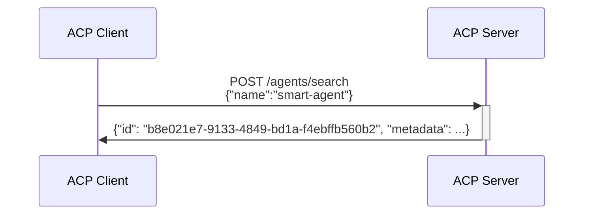
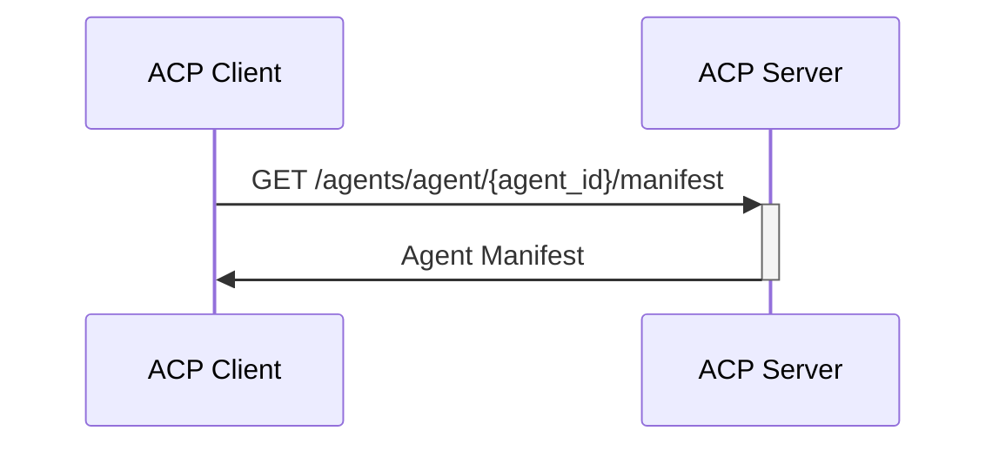

# Agent Connect Protocol Specification

## Getting Started

Explore the ACP specification by browsing the OpenAPI view [https://agntcy.github.io/acp-spec/docs/openapi.html].

Learn how to use the API by looking at [API Usage Flows](#api-usage-flows)

Learn about Agent Manifest and its usage here (#agent_manifest)

Explore tools for ACP and Agent Manifest in the [Agent Control SDK Repo](agntcy.github.io/acp-sdk) 


## API Usage Flows

### Agents APIs

ACP offers an API to search for the agents served by the ACP server. 
Once a client has an agent identifier `AgentID`, it can use it to either retreive the agent manifest or to control agent runs.

#### Example: Retrieve all agents supported by the server

```mermaid
sequenceDiagram
    participant C as ACP Client
    participant S as ACP Server
    C->>+S: POST /agents/search {}
    S->>-C: [<br/>
    {"id": "b8e021e7-9133-4849-bd1a-f4ebffb560b2", "metadata": ...}<br/>
    {"id": "6f3a4236-f91e-4094-8127-f4a585d23594", "metadata": ...}<br/>
    ]
```

#### Example: Retrieve agent from its name



#### Example: Retrieve agent manifest from its identifier



# Agent Manifest
[TBD]
