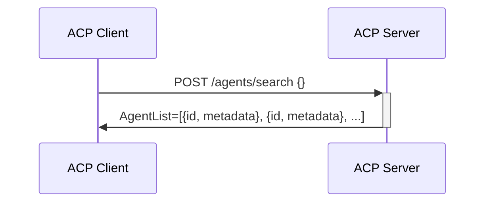
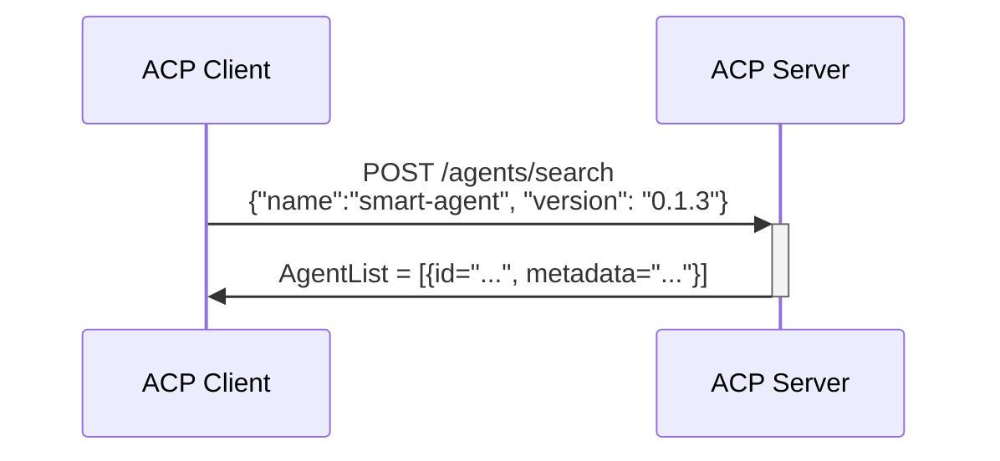
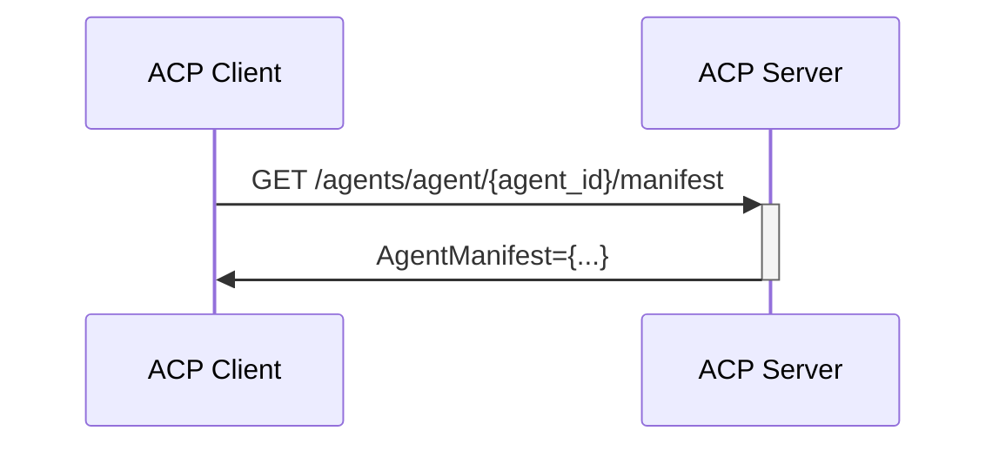
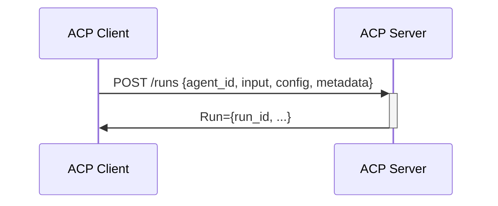

# Agent Connect Protocol Specification

## Getting Started

Explore the ACP specification by browsing the OpenAPI view [https://agntcy.github.io/acp-spec/docs/openapi.html].

Learn how to use the API by looking at [API Usage Flows](#api-usage-flows)

Learn about Agent Manifest and its usage here (#agent_manifest)

Explore tools for ACP and Agent Manifest in the [Agent Control SDK Repo](agntcy.github.io/acp-sdk) 

## API Usage Flows

### Agents APIs

ACP offers an API to search for the agents served by the ACP server. 
Once a client has an agent identifier `AgentID`, it can use it to either retreive the agent manifest or to control agent runs.

#### Retrieve all agents supported by the server

#### Retrieve an agent from its name and version

#### Retrieve agent manifest from its identifier

### Runs
A run is a single execution of an agent.

#### Starting a Run of an Agent

In the sequence above the client is requesting a run to the server on a specific agent, providing the `agent_id`, and specifying:
* configuration: a run configuration is flavoring the behavior of this agent for this run
* input: run input provides the data the agent will operate on
* metadata: metadata is a free format object that can be used by the client to tag the run with arbitrary information

Note that the format of the input and the configuration are not specified by ACP, but they are defined in the agent manifest.

### Thread Runs

## Agent Manifest
[TBD]
