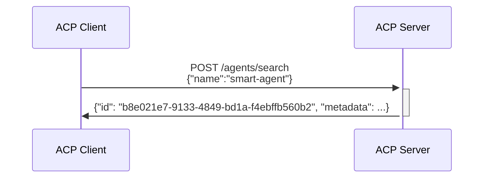

# Agent Connect Protocol Specification

## Getting Started

Explore the ACP specification by browsing the OpenAPI view [https://agntcy.github.io/acp-spec/docs/openapi.html].

Learn how to use the API by looking at [API Usage Flows](#api-usage-flows)

Learn about Agent Manifest and its usage here (#agent_manifest)

Explore tools for ACP and Agent Manifest in the [Agent Control SDK Repo](agntcy.github.io/acp-sdk) 

## API Usage Flows

### Look for agents served by the ACP endpoints
ACP offers an API to search for the agents served by the ACP server.

# Agent Manifest
[TBD]
