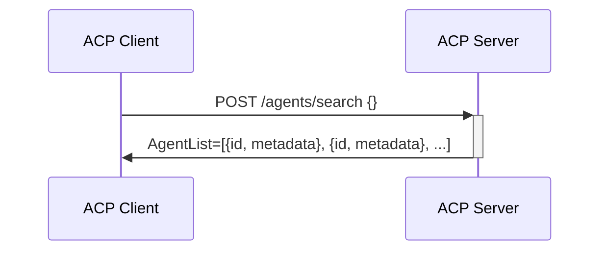
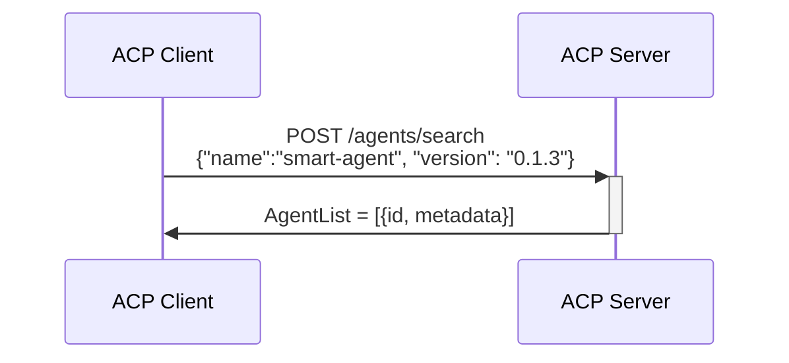
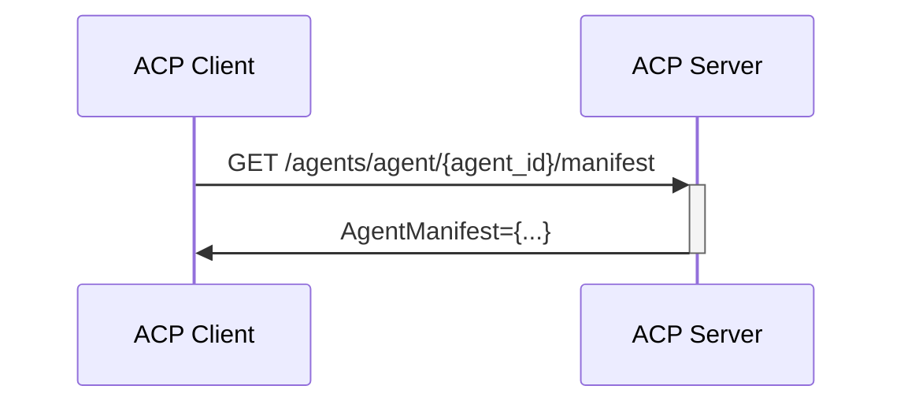
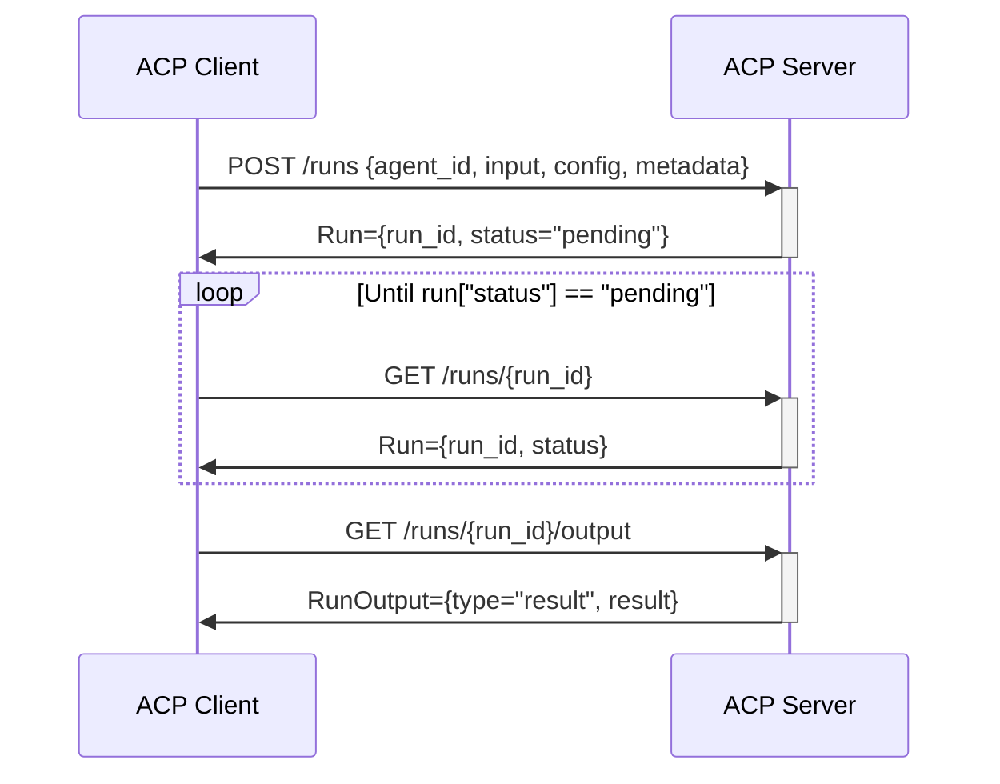
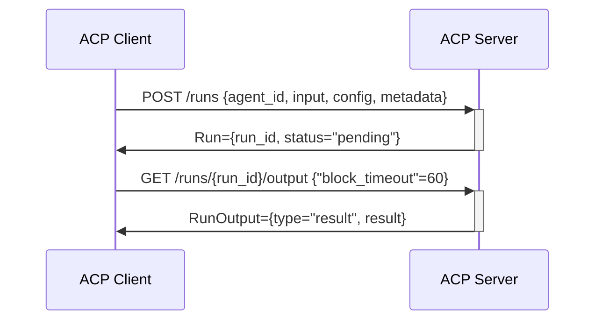
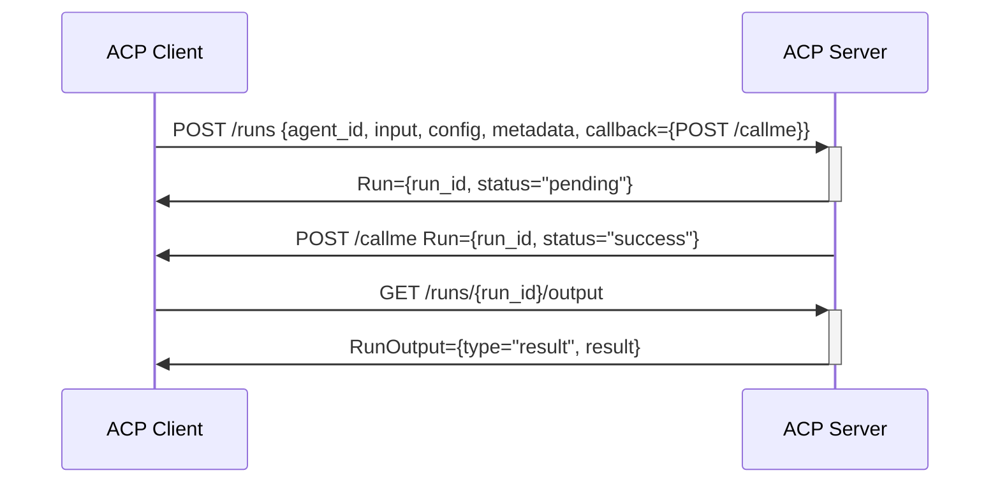
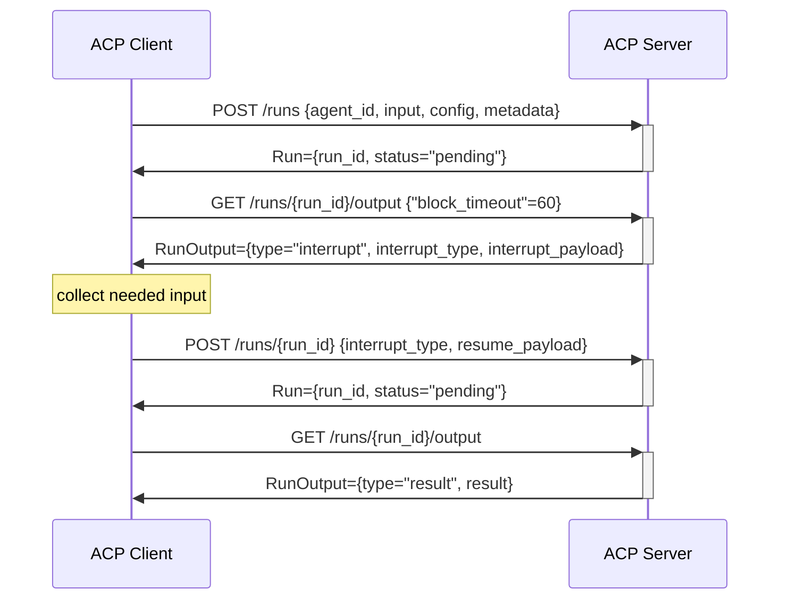
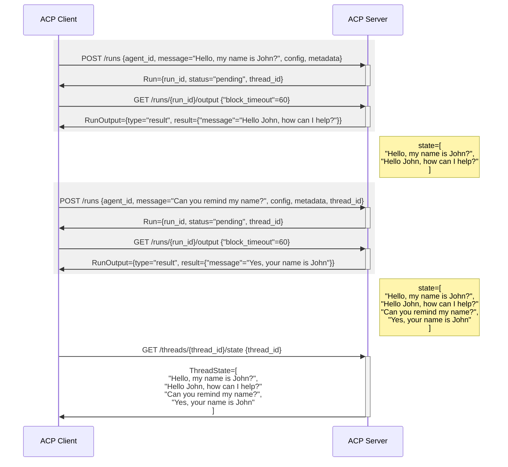

# Agent Connect Protocol Specification

## Getting Started

Explore the ACP specification by browsing the OpenAPI view [https://agntcy.github.io/acp-spec/docs/openapi.html].

Learn how to use the API by looking at [API Usage Flows](#api-usage-flows)

Learn about Agent Manifest and its usage here (#agent_manifest)

Explore tools for ACP and Agent Manifest in the [Agent Control SDK Repo](agntcy.github.io/acp-sdk) 

## API Usage Flows

### Agents APIs

ACP offers an API to search for the agents served by the ACP server. 
Once a client has an agent identifier `AgentID`, it can use it to either retreive the agent manifest or to control agent runs.

#### Retrieve all agents supported by the server
In this case the client is doing a search of all agents in the server without specifying any search filter. Results is a list of agents.

#### Retrieve an agent from its name and version
In this case the client known name and version of an agent (e.g. learnt from the manifest) and wants to retrieve its `id` to interact with the agent.

#### Retrieve agent manifest from its identifier
In this case the client known the agent id and wants to retrieve its manifest to learn about the capabilities supported and the data scehmas to use.

### Runs
A run is a single execution of an agent.

#### Start a Run of an Agent and poll for completion
In this case, the clients starts a background run of an agent,  keeps polling the server until the run is complete, finally it retrieves the run output.

In the sequence above:
1. The client requests to start a run on a specific agent, providing its `agent_id`, and specifying:
    * configuration: a run configuration is flavoring the behavior of this agent for this run
    * input: run input provides the data the agent will operate on
    * metadata: metadata is a free format object that can be used by the client to tag the run with arbitrary information
1. The server returns a run object which include the run identifier and a status, which at the beginning will be `pending`.
1. The client retrieves the status of the run until completion
1. The server returns the run object with the updated status
1. The client request the output of the run
1. The server return the final result of the run.

>  
> Note that the format of the input and the configuration are not specified by ACP, but they are defined in the agent manifest.
>

#### Start a Run of an Agent and block until completion
In this case, the clients starts a background run of an agent and immediately tries to retrieve the run output blocking on this call until completion or timeout.

In the sequence above:
1. The client requests to start a run on a specific agent
1. The client request the output of the run providing addition `block_timeout` parameter, and blocs until run status changes or timeout expires.
1. The server return the final result of the run. Note that in case the timeout expired before, the server would have returned no content.

#### Start a Run of an Agent with a callback
Agents can support callbacks, i.e. asynchronously call back the client upon run status change. The support for interrupts is signalled in the agent manifest.

In this case, the clients starts a background run of an agent and provide a callback to be called upon completion.

In the sequence above:
1. The client requests to start a run on a specific agent, providing an additional `callback`
1. The server returns a run object
1. Upon status change, the server calls the provided call back with the run object.
1. The client request the output of the run
1. The server return the final result of the run.

### Run Interrupt and Resume
Agent can support interrupts, i.e. the run execution can interrupt to request additional input to the client. The support for interrupts is signalled in the agent manifest.

When an interrupt occurs, the server provides the client with an interrupt payload, which specifies the interrupt type that have occurred and all the information associated with that interrupt, i.e a request for additional input.

The client can collect the needed iput for the specific interrupt and resume the run by providing the resume payload, i.e. the additional input requested by the interrupt.

>  
> Note that the type of interrupts and the correspondent interrupt and resume payload are not specified by ACP, because they are agent dependent. They are instead specified in the agent manifest.
>

The interrput is provided by the server when the client requests the output.

### Start a run and resume it upon interruption

In this case, the client asks for the agent output and receives and interrupt intead of the final output. The client then resumes the run providing the needed input and finally when run is completed, gets the result.

In the sequence above:
1. The client start the run
1. The server returns the run object
1. The client requests the output
1. The server returns an interrupt, specifying interrupt type and the associateed payload
1. The client resumes the run providing the needed input in the resume payload
1. the client requests the output
1. The server returns the final result.

### Thread Runs
Agents can support thread run. Support for thread run is signalled in the agent manifest.

When an agent supports thread run, each run is associated to a thread, and at the end of the run a thread state is kept in the server.

Subsequent runs on the same thread use the previously created state, together with the run input provided.

The server offers ways to retrieve the current thread state and the history of the runs on a thread and the evolution of the thread states over execution of runs.

>  
> Note that the format of the thread state is not specified by ACP, but it is (optionally) defined in the agent manifest. If specified, it can be retrieved by the client, if not it's not accessible to the client.
>

### Start of multiple runs over the same thread
In this case the client starts a sequence of runs on the same threads accumulating a state in the server. In this specific example the input is a chat message, while the state kept in the server is the chat history.

In the sequence above:
1. The client starts the first run and provides the first message of the chat
1. The server return the run object which **includes a thread ID** because the server supports threaded runs
1. The client requests the run output
1. The server returns the run output which is the next chat message from the agent and leaves a state with the current chat history.
1. The client starts a new run providing:
    * the same thread ID, which means that the run will use the existing state associated with the thread
    * the input for the run, i.e. the next message in the chat (assuming the existence of the server of the chat history)
1. The server start the runs using the existing chat history and returns the run object
1. The client requests the run output
1. The server update the thread state and returns the run output
1. Finally, the client requests the thread state (this is an optional operation)
1. The server returns the current thread state which collect the whole chat history

## Agent Manifest
[TBD]
