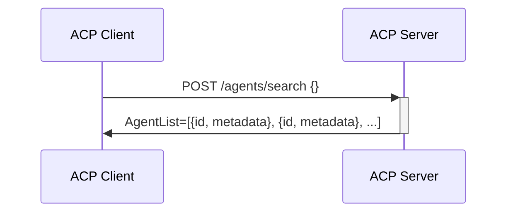
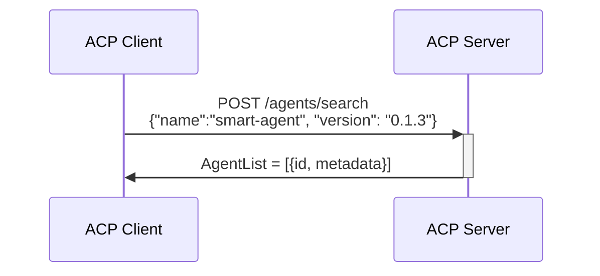
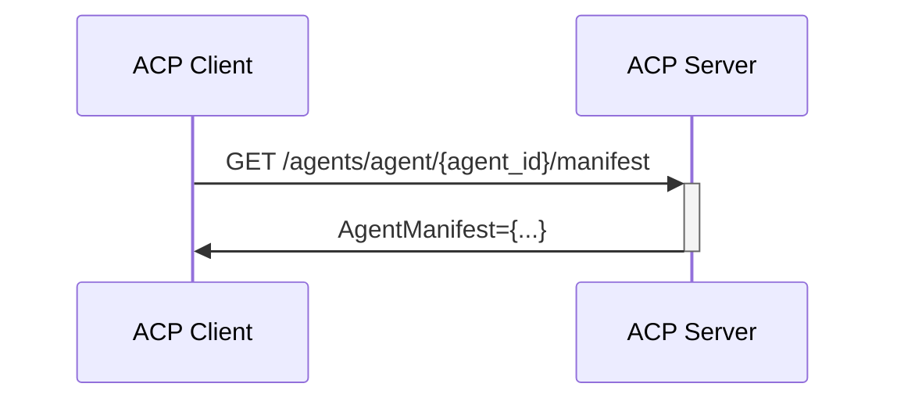
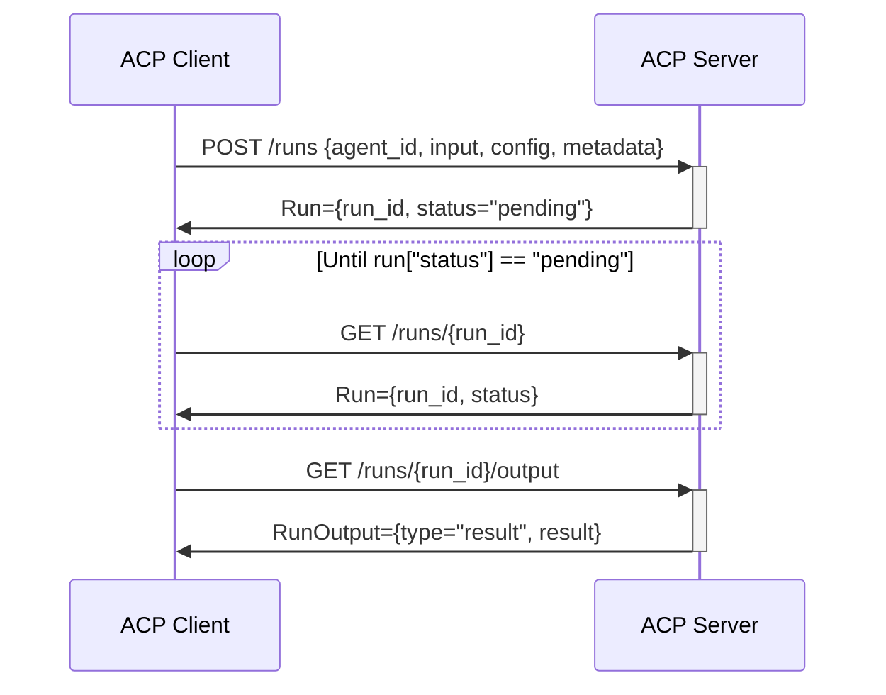
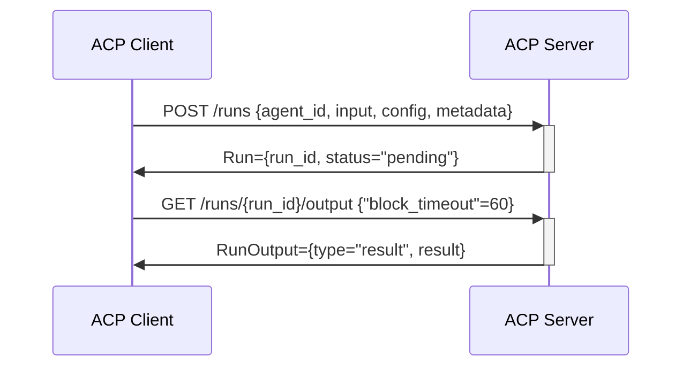

# Agent Connect Protocol Specification

## Getting Started

Explore the ACP specification by browsing the OpenAPI view [https://agntcy.github.io/acp-spec/docs/openapi.html].

Learn how to use the API by looking at [API Usage Flows](#api-usage-flows)

Learn about Agent Manifest and its usage here (#agent_manifest)

Explore tools for ACP and Agent Manifest in the [Agent Control SDK Repo](agntcy.github.io/acp-sdk) 


## API Usage Flows

### Agents APIs

ACP offers an API to search for the agents served by the ACP server. 
Once a client has an agent identifier `AgentID`, it can use it to either retreive the agent manifest or to control agent runs.

#### Retrieve all agents supported by the server
In this case the client is doing a search of all agents in the server without specifying any search filter. Results is a list of agents.



#### Retrieve an agent from its name and version
In this case the client known name and version of an agent (e.g. learnt from the manifest) and wants to retrieve its `id` to interact with the agent.



#### Retrieve agent manifest from its identifier
In this case the client known the agent id and wants to retrieve its manifest to learn about the capabilities supported and the data scehmas to use.



### Runs
A run is a single execution of an agent.

#### Start a Run of an Agent and poll for completion
In this case, the clients starts a background run of an agent,  keeps polling the server until the run is complete, finally it retrieves the run output.



In the sequence above:
1. The client requests to start a run on a specific agent, providing its `agent_id`, and specifying:
    * configuration: a run configuration is flavoring the behavior of this agent for this run
    * input: run input provides the data the agent will operate on
    * metadata: metadata is a free format object that can be used by the client to tag the run with arbitrary information
1. The server returns a run object which include the run identifier and a status, which at the beginning will be `pending`.
1. The client retrieves the status of the run until completion
1. The server returns the run object with the updated status
1. The client request the output of the run
1. The server return the final result of the run.

> [!NOTE]  
> Note that the format of the input and the configuration are not specified by ACP, but they are defined in the agent manifest.

#### Start a Run of an Agent and block until completion
In this case, the clients starts a background run of an agent and immediately tries to retrieve the run output blocking on this call until completion or timeout.




In the sequence above:
1. The client requests to start a run on a specific agent
1. The client request the output of the run providing addition `block_timeout` parameter, and blocs until run status changes or timeout expires.
1. The server return the final result of the run. Note that in case the timeout expired before, the server would have returned no content.


#### Start a Run of an Agent with a callback
In this case, the clients starts a background run of an agent and provide a callback to be called upon completion.

```mermaid
sequenceDiagram
    participant C as ACP Client
    participant S as ACP Server
    C->>+S: POST /runs {agent_id, input, config, metadata, callback={POST /callme}}
    S->>-C: Run={run_id, status="pending"}
    loop Until run["status"] == "pending"
    S->>C: POST /callme Run={run_id, status="success"}
    C->>+S: GET /runs/{run_id}/output
    S->>-C: RunOutput={type="result", result}
```
In the sequence above:
1. The client requests to start a run on a specific agent, providing an additional `callback`
1. The server returns a run object
1. Upon status change, the server calls the provided call back with the run object.
1. The client request the output of the run
1. The server return the final result of the run.

#### Run Interrupt and Resume
In this case, the client starts a run and when it request  


### Thread Runs


## Agent Manifest
[TBD]
